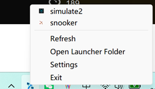
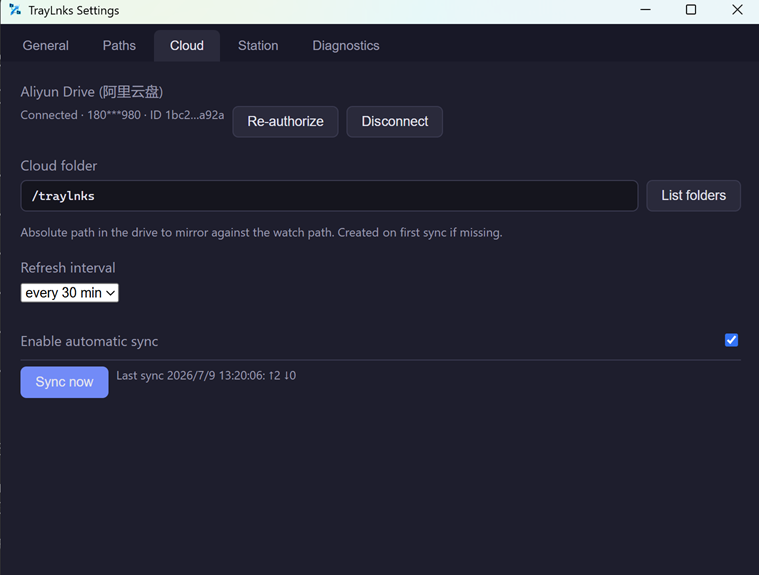

# TrayLnks

**中文** | [English](#english)

轻量级 Windows 托盘链接启动器：把一个本地文件夹映射成多级系统托盘菜单，**文件系统即配置**。

<p align="center">
  
</p>

## 功能

- 文件夹 → 递归子菜单
- `<name>.lnk` / `.cmd` / `.ps1` → 菜单项（`.ps1` 用 `powershell -NoProfile -ExecutionPolicy Bypass -File` 启动，避免被编辑器打开）
- 启动后尽量把窗口带到前台
- 同名图片作为图标：`<name>.ico/.png/.jpg/.jpeg`（文件夹也支持，如 `Development/` + `Development.png`）
- 无同名图标时，按路径哈希从 50 个内置 fallback 图标中稳定分配一个
- `.station` 文件按 Windows 主机名过滤子树
- 其他文件被忽略

完整规则见 [prd.md](./prd.md)。

## 示例

监听目录：

```text
TrayLauncher/
├── Development/
│   ├── Terminal.lnk
│   └── Codex.lnk        # 配 Codex.png 作为图标
└── Projects/
    └── Snooker/
        └── Open Workspace.lnk
```

生成菜单：

```text
Development >
    Terminal
    Codex
Projects >
    Snooker >
        Open Workspace
```

## .station 主机过滤

在目录中放 `.station`，每行一个允许显示该目录的主机名：

```text
DESKTOP-PAMJPBD
TIM-LAPTOP
```

不区分大小写、精确匹配；`#` 起始为注释，空行忽略；空 `.station` 在所有主机隐藏该目录；父目录不匹配则整个子树跳过。

## 网盘同步（v0.2，阿里云盘）

设置 → Cloud 标签页：用阿里云盘 App 扫码授权，选择云端文件夹（如 `/TrayLnks`），即可在多台机器间双向镜像 `watch_path`。冲突按修改时间「最后写入胜出」，删除会双向传播。刷新间隔默认 30 分钟（可选 15/60/120）。

<p align="center">
  
</p>

- **零注册**：走网页客户端公开扫码登录（[aligo](https://github.com/foyoux/aligo) 同款流程），无需在阿里云盘开放平台注册应用、无需 AppKey。
- 架构按 `CloudProvider` trait 设计，当前仅实现阿里云盘，后续可扩展其他供应商。
- 凭据存入系统凭据管理器（Windows Credential Manager / DPAPI），**不会**写入 `config.toml`（该文件会序列化到前端）。
- 已知限制：`.lnk` 内嵌机器相关绝对路径，跨机同步后目标可能无法解析；`.cmd`/`.ps1` 可移植性更好。

## 运行

```powershell
Start-Process .\traylnks.exe
```

首次启动后在 **Settings → Paths → Browse...** 选择监听目录并保存，菜单立即重建并开始监听。配置由设置界面管理：

```text
%APPDATA%\com.traylnks.launcher\config.toml
```

```toml
watch_path              = "D:\\TrayLauncher"
start_minimized         = true
autostart               = false
# 网盘同步（v0.2，可选）
cloud_enabled           = false
cloud_provider          = "aliyun"
cloud_folder            = "/TrayLnks"     # 阿里云盘里的同步根目录，首次同步时不存在则创建
cloud_sync_interval_min = 30              # 自动同步间隔（分钟）
```

## 项目结构

```text
frontend/          静态设置界面（HTML/JS/CSS）
src-tauri/         Tauri v2 + Rust 后端
  src/
    menu_tree.rs   扫描目录生成菜单树
    tray.rs        托盘菜单构建 / 刷新 / 点击路由
    watcher.rs     文件变化监听 + 防抖
    icon.rs        同名图标解析 + fallback
    config.rs      TOML 配置读写
    station.rs     .station 主机过滤
    commands.rs    设置界面调用的 commands
tools/icon-gen/    应用图标源图与生成工具
```

## 构建

目标 Windows 10/11，从 WSL Debian 交叉编译（`cargo-xwin` → `x86_64-pc-windows-msvc`）。

一次性工具链：

```bash
curl --proto '=https' --tlsv1.2 -sSf https://sh.rustup.rs | sh -s -- -y && source "$HOME/.cargo/env"
sudo apt install -y build-essential pkg-config libssl-dev nsis lld llvm clang libayatana-appindicator3-dev
rustup target add x86_64-pc-windows-msvc
cargo install --locked cargo-xwin
cargo install --locked tauri-cli --version "^2.0"
```

构建独立 `.exe`：

```bash
cd src-tauri
cargo tauri build --runner cargo-xwin --target x86_64-pc-windows-msvc -- --locked
# → src-tauri/target/x86_64-pc-windows-msvc/release/traylnks.exe
```

`bundle.targets` 默认为 `[]`（仅独立 `.exe`）；改为 `["nsis"]` 可输出安装包。

## 图标

```bash
(cd tools/icon-gen && cargo run --release)   # 源图 → src-tauri/icons/icon.png
(cd src-tauri && cargo tauri icon ../tools/icon-gen/assets/traylnks-icon-source.png)
```

托盘图标复用 Tauri 默认应用图标，重新生成 `icons/icon.ico`/`icon.png` 后托盘与 exe 图标同步更新。fallback 菜单图标位于 `src-tauri/assets/fallback-icons/`。

## 测试

```bash
cargo fmt --all --manifest-path src-tauri/Cargo.toml
cd src-tauri && cargo xwin clippy --target x86_64-pc-windows-msvc -- -D warnings
cargo xwin test --target x86_64-pc-windows-msvc --lib --no-run   # 再运行 target/.../traylnks_lib-*.exe
```

---

## English

A lightweight Windows tray link launcher: map a local folder into a multi-level system tray menu — **the filesystem is the config**.

<p align="center">
  
</p>

## Features

- Folders → recursive submenus
- `<name>.lnk` / `.cmd` / `.ps1` → menu items (`.ps1` runs via `powershell -NoProfile -ExecutionPolicy Bypass -File`, so it executes instead of opening in an editor)
- Best-effort foreground focus on launch
- Same-name image as icon: `<name>.ico/.png/.jpg/.jpeg` (folders too, e.g. `Development/` + `Development.png`)
- Items without a matching icon get a stable path-hashed pick from 50 built-in fallbacks
- `.station` files filter a subtree by Windows hostname
- Other files are ignored

Full rules in [prd.md](./prd.md).

## Example

Watched folder:

```text
TrayLauncher/
├── Development/
│   ├── Terminal.lnk
│   └── Codex.lnk        # pair with Codex.png for an icon
└── Projects/
    └── Snooker/
        └── Open Workspace.lnk
```

Generated menu:

```text
Development >
    Terminal
    Codex
Projects >
    Snooker >
        Open Workspace
```

## .station Host Filtering

Drop a `.station` file in a folder, one allowed hostname per line:

```text
DESKTOP-PAMJPBD
TIM-LAPTOP
```

Case-insensitive, exact match; `#` lines are comments, blank lines ignored; an empty `.station` hides the folder everywhere; if a parent doesn't match, the whole subtree is skipped.

## Cloud Sync (v0.2, Aliyun Drive)

Settings → Cloud tab: authorize by scanning a QR with the Aliyun Drive app, pick a cloud folder (e.g. `/TrayLnks`), and `watch_path` is two-way mirrored across machines. Conflicts resolve last-write-wins by mtime; deletions propagate both ways. Refresh interval defaults to 30 min (15/60/120 selectable).

<p align="center">
  
</p>

- **Zero registration**: uses the web-client public QR login (the same flow as [aligo](https://github.com/foyoux/aligo)) — no app registration or AppKey needed.
- Built around a `CloudProvider` trait — only Aliyun Drive is implemented today; other providers are additive later.
- Tokens live in the OS credential store (Windows Credential Manager / DPAPI) and **never** in `config.toml` (which is serialized to the webview).
- Known limitation: `.lnk` files embed machine-specific absolute target paths and may not resolve on another machine after sync; `.cmd`/`.ps1` are more portable.

## Running

```powershell
Start-Process .\traylnks.exe
```

On first launch, pick a folder via **Settings → Paths → Browse...** and save — the menu rebuilds and starts watching. Config is managed by the settings UI:

```text
%APPDATA%\com.traylnks.launcher\config.toml
```

```toml
watch_path              = "D:\\TrayLauncher"
start_minimized         = true
autostart               = false
# Cloud sync (v0.2, optional)
cloud_enabled           = false
cloud_provider          = "aliyun"
cloud_folder            = "/TrayLnks"     # sync root inside the cloud drive; created on first sync if missing
cloud_sync_interval_min = 30              # auto-sync cadence in minutes
```

## Repository Layout

```text
frontend/          Static settings UI (HTML/JS/CSS)
src-tauri/         Tauri v2 + Rust backend
  src/
    menu_tree.rs   Scans folders into a menu tree
    tray.rs        Tray menu build / refresh / click routing
    watcher.rs     Filesystem watch + debounce
    icon.rs        Same-name icon resolution + fallbacks
    config.rs      TOML config read/write
    station.rs     .station hostname filtering
    commands.rs    Commands used by the settings UI
tools/icon-gen/    App icon source artwork + generator
```

## Build

Targeting Windows 10/11, cross-compiled from WSL Debian (`cargo-xwin` → `x86_64-pc-windows-msvc`).

One-time toolchain:

```bash
curl --proto '=https' --tlsv1.2 -sSf https://sh.rustup.rs | sh -s -- -y && source "$HOME/.cargo/env"
sudo apt install -y build-essential pkg-config libssl-dev nsis lld llvm clang libayatana-appindicator3-dev
rustup target add x86_64-pc-windows-msvc
cargo install --locked cargo-xwin
cargo install --locked tauri-cli --version "^2.0"
```

Build a standalone `.exe`:

```bash
cd src-tauri
cargo tauri build --runner cargo-xwin --target x86_64-pc-windows-msvc -- --locked
# → src-tauri/target/x86_64-pc-windows-msvc/release/traylnks.exe
```

`bundle.targets` defaults to `[]` (standalone `.exe` only); set it to `["nsis"]` for an installer.

## Icons

```bash
(cd tools/icon-gen && cargo run --release)   # source → src-tauri/icons/icon.png
(cd src-tauri && cargo tauri icon ../tools/icon-gen/assets/traylnks-icon-source.png)
```

The tray icon reuses Tauri's default app icon, so regenerating `icons/icon.ico`/`icon.png` updates both tray and exe. Fallback menu icons live in `src-tauri/assets/fallback-icons/`.

## Tests

```bash
cargo fmt --all --manifest-path src-tauri/Cargo.toml
cd src-tauri && cargo xwin clippy --target x86_64-pc-windows-msvc -- -D warnings
cargo xwin test --target x86_64-pc-windows-msvc --lib --no-run   # then run target/.../traylnks_lib-*.exe
```
